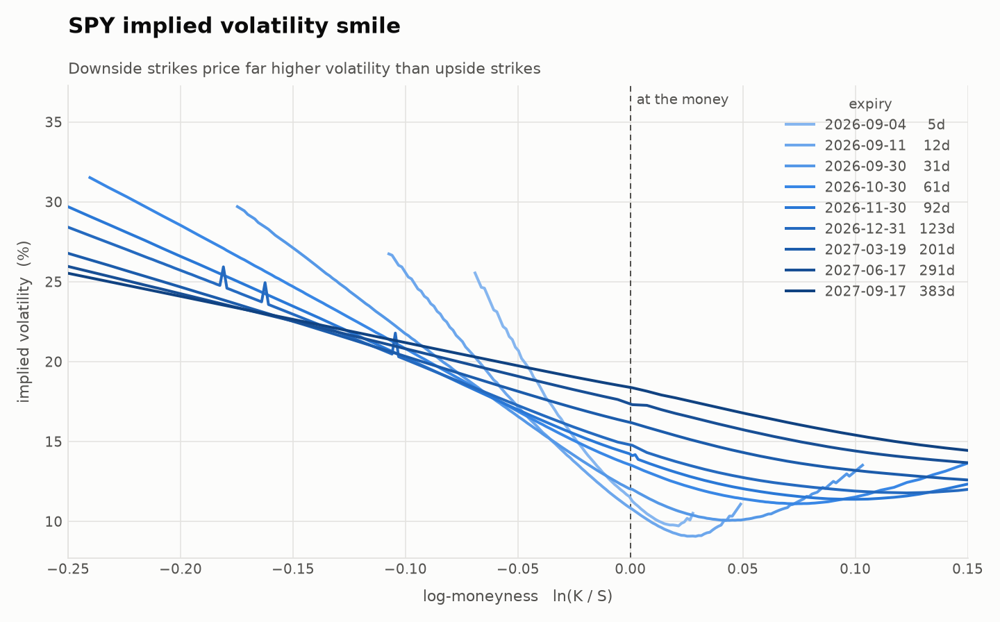
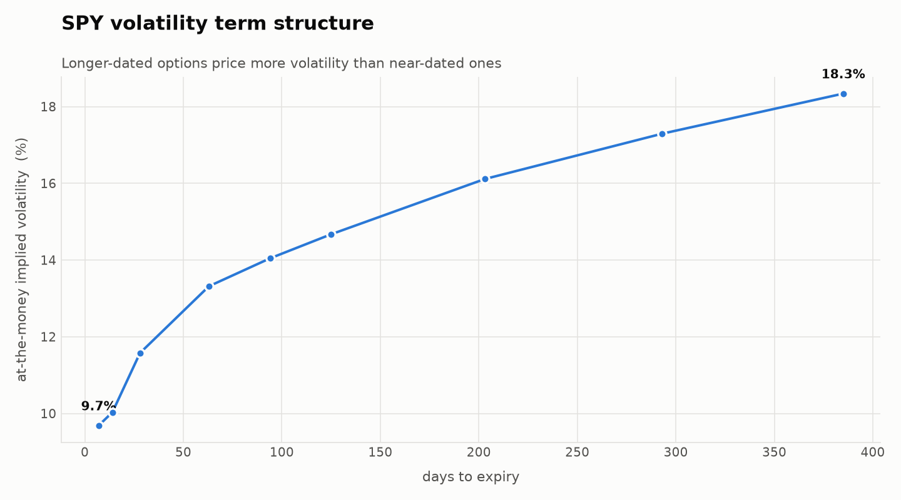
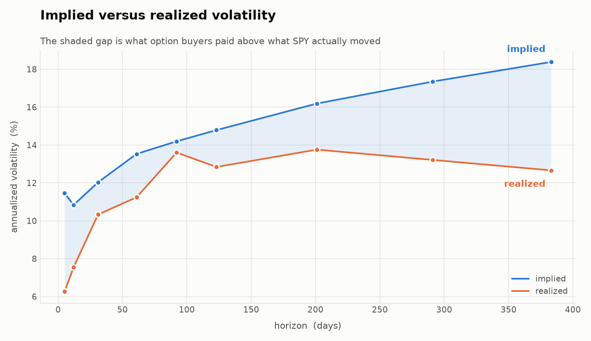

# SPY Implied Volatility Surface

Building a volatility surface from SPY option chains: pulling live quotes, inverting
Black-Scholes numerically for implied volatility, and measuring where the model's
assumptions break.



## The question

Black-Scholes prices an option from five inputs. Four of them — spot, strike, time to
expiry, and the interest rate — can be looked up. The fifth, volatility, cannot: it
describes the future and exists nowhere.

But the market publishes the *answer* — the option's price. So the equation can be run
backwards: given the price, solve for the volatility that produces it. That number is
the **implied volatility**, and it is the market's own estimate of how much SPY will
move, expressed in a unit everyone agrees on.

If Black-Scholes were literally true, a single volatility would price every contract on
SPY. It does not. **This project maps exactly how and where it fails.**

## Findings

### 1. The volatility skew

Implied volatility falls steeply as strike rises. On the 31-day expiry:

| strike vs spot | implied volatility |
| --- | --- |
| 16% below | 30.0% |
| just above | 9.7% |
| 10% above | 12.9% |

Same underlying, same 31 days, one contract per strike. Black-Scholes requires these to
be equal. The gap is the market pricing crash risk: real markets fall faster than a
lognormal distribution allows, and investors holding shares buy puts as insurance, which
is persistent one-directional demand at low strikes.

Short-dated expiries show a markedly steeper skew than long-dated ones, and the curves
cross around 12% below spot — near-term fear is concentrated in a crash scenario, while
long-dated volatility reflects general uncertainty growing with time.

### 2. The term structure is upward sloping



At-the-money implied volatility rises from **11.5% at 5 days to 18.4% at 383 days** —
the normal shape in a calm market. There is a local minimum around 12 days that would
need more snapshots to interpret confidently.

Interpolated onto standard tenors, in total variance rather than volatility (variance
accumulates roughly linearly in time; interpolating volatility directly can imply
negative variance over an interval, which is an arbitrage):

| tenor | 7d | 14d | 30d | 60d | 90d | 180d | 270d | 365d |
| --- | --- | --- | --- | --- | --- | --- | --- | --- |
| ATM IV | 11.2% | 11.1% | 12.0% | 13.5% | 14.2% | 15.9% | 17.2% | 18.2% |

### 3. SPY's dividend schedule, recovered from option prices

Rather than assuming an interest rate and a dividend yield, the forward price for each
expiry is implied directly from put-call parity, using 1,054 matched call/put pairs.
Converting each forward back into an equivalent continuous dividend yield gives:

| expiry | days | forward | F/S − 1 | implied yield |
| --- | --- | --- | --- | --- |
| 2026-09-04 | 5 | 769.75 | 0.05% | 0.21% |
| 2026-09-11 | 12 | 770.19 | 0.11% | 0.68% |
| 2026-09-30 | 31 | 769.63 | 0.04% | **3.57%** |
| 2026-10-30 | 61 | 772.44 | 0.40% | 1.60% |
| 2026-11-30 | 92 | 775.16 | 0.75% | 1.02% |
| 2026-12-31 | 123 | 776.39 | 0.91% | 1.30% |
| 2027-03-19 | 201 | 783.15 | 1.79% | 0.77% |
| 2027-06-17 | 291 | 790.18 | 2.71% | 0.65% |
| 2027-09-17 | 383 | 797.60 | 3.67% | 0.56% |

The 3.57% is not an error. SPY's last dividend was 18 June 2026, so the next fell around
**18 September**. The two expiries before that date imply near-zero yields. The 31-day
expiry is the first to cross it, and has to absorb one whole quarterly payment over a
short window: `1.90 / (769.35 * 31/365) = 2.9%` annualized, against 3.57% measured. As
the window lengthens, one discrete payment spread over more time converges toward the
true annual yield of roughly 1%.

This was also a real bug fix. An earlier version assumed a flat dividend yield, which
made calls and puts at the same strike imply different volatilities — a visible
discontinuity in the smile at the money. Implying the forward from parity closed it:

| | put/call seam |
| --- | --- |
| assumed rate and yield | up to 1.1 vol points |
| implied forward | max 0.32, most under 0.2 |

### 4. Options were priced above what SPY delivered



| horizon | implied | realized | premium |
| --- | --- | --- | --- |
| 5d | 11.46% | 6.26% | +5.19 |
| 12d | 10.83% | 7.55% | +3.29 |
| 31d | 12.03% | 10.33% | +1.70 |
| 61d | 13.53% | 11.24% | +2.29 |
| 92d | 14.19% | 13.60% | +0.59 |
| 123d | 14.79% | 12.84% | +1.94 |
| 201d | 16.19% | 13.76% | +2.43 |
| 291d | 17.35% | 13.21% | +4.14 |
| 383d | 18.38% | 12.66% | +5.72 |

Implied exceeds realized at **every one of nine horizons**, mean **+3.03 volatility
points**. This is the variance risk premium: option sellers act as insurers and are paid
more than the average claim, in compensation for carrying the risk of large moves.

**Caveat, stated plainly:** this compares forward-looking implied volatility against
*trailing* realized volatility over a matched lookback. A strict test would compare
implied volatility at a moment against what happened *afterwards*, which requires
waiting rather than measuring.

## Method

```
Yahoo Finance
     |  3,560 quoted contracts across 9 expiries
     v
fetch_chain        9 expiries sampled by a rule targeting 7/14/30/60/90/120/180/270/365
     |             days; T, mid and spread computed
     v
clean_chain        six quality filters                            ->  2,430
     |
     v
implied_forwards   put-call parity -> one forward per expiry
     |
     v
keep_otm           out-of-the-money contracts only                ->  1,342
     |
     v
add_implied_vol    bisection on Black-Scholes -> sigma per contract
     |
     v
data/surface.csv   ->  plots.py, realized.py, term_structure.py
```

`implied_forwards` must run before `keep_otm`, because parity needs matched call/put
pairs at the same strike and `keep_otm` keeps only one side of each.

### Inverting for implied volatility

Volatility cannot be isolated algebraically — it sits inside the normal CDF twice, which
has no elementary inverse. So the solver searches.

**Bisection**, bracketing sigma in [0.001, 5.0] and halving until the bracket is narrower
than 1e-6 — about 23 iterations. It is safe because **option price is strictly
increasing in volatility**, which guarantees exactly one solution and tells the search
which direction to step.

Newton's method, using vega as the slope, converges in roughly 4 iterations instead of
23, but can diverge where vega approaches zero — precisely the deep in-the-money and far
out-of-the-money contracts. At this scale reliability is worth more than speed.

The solver returns `NaN` when no volatility in the bracket can reproduce the observed
price, rather than silently returning a bracket boundary. Before the dividend and
forward corrections this flagged 146 contracts; afterwards, zero.

### Data quality

A third of quoted contracts carry no usable volatility signal. The solver never refuses
a bad quote — it returns a plausible-looking number — so filtering is the only defence.

| filter | fails alone | additional cut | reason |
| --- | --- | --- | --- |
| `bid > 0` | 180 | 180 | no bid means the mid is not a price |
| `ask > bid` | 69 | 0 | crossed quotes are feed artifacts |
| `spread / mid <= 0.25` | 384 | 204 | a quote a quarter of its own width has no midpoint |
| `abs(ln(K/S)) <= 3 * sigma * sqrt(T)` | 958 | 697 | strikes beyond reach carry no signal |
| `T >= 3/365` | 0 | 0 | near-expiry vega collapses |
| `volume > 0 or OI > 0` | 95 | 49 | somebody must trade or hold it |

**2,430 of 3,560 kept (68.3%).**

The moneyness band scales with `sqrt(T)` rather than being a fixed percentage. A strike
10% below spot is 4.3 typical moves away at 5 days — priced at zero, unreachable — but
only 0.5 typical moves at 383 days, where it trades actively and is worth $21.75. The
same percentage means entirely different things at different maturities.

Prices are bid/ask **midpoints**, never last traded price: last trades can be days stale
(one raw row had not traded in eight days) and execute at the bid or the ask rather than
in the middle.

Out-of-the-money contracts only — puts below spot, calls above. They are almost pure
time value, they are the liquid side of each strike, and they avoid the deep
in-the-money region where any residual forward error is amplified. CBOE constructs VIX
the same way.

## Validation

**Against the vendor.** Yahoo publishes its own implied volatility, kept as `yf_iv` for
comparison and never used as an input. Median difference **+0.0069**, with 47.7% of
contracts within 0.01. The residual is consistent with Yahoo pricing off stale last-trade
prices rather than midpoints.

**Against VIX.** At-the-money 30-day implied volatility is 12.01%, against a published
VIX of 14.43%. That gap is not an error: VIX is not an at-the-money measure but a
variance-swap calculation integrating every out-of-the-money strike, weighted by
`1 / K^2`, which puts the most weight on the low strikes — exactly where the skew makes
volatility highest. Recomputing VIX's way from this project's own chain gives **14.00%**,
within 0.43 points of the published index.

| | value |
| --- | --- |
| our at-the-money, 30d | 12.01% |
| our VIX-style calculation | 14.00% |
| published VIX | 14.43% |

The residual is explained by VIX being written on SPX rather than SPY, blending two
expiries around 30 days rather than using one, and an approximate strike weighting.

## Limitations

- **American options priced with a European model.** SPY options are American;
  Black-Scholes prices European. This is a standard approximation for SPY — early
  exercise is only meaningfully valuable around dividend dates and for deep
  in-the-money puts — but SPX options would be the rigorous choice.
- **A single snapshot**, taken at the close on Friday 28 August 2026, with SPY at
  769.35. Nothing here describes how the surface evolves.
- **Free vendor data.** Yahoo quotes, not exchange data, with imprecise timestamps.
- **A flat 4% risk-free rate**, rather than a Treasury yield matched to each maturity.
  The forward is implied from parity, which absorbs much of this, but not the
  discounting.
- **Term structure sampled at listed expiries**, so points sit at 201 days rather than
  180. Fine for one snapshot; comparing surfaces across days would require interpolating
  onto a fixed grid first.
- **Implied is compared against trailing realized volatility**, as noted above.

## Next steps

- Fit a smooth, arbitrage-free surface (SVI, or a spline in log-moneyness and total
  variance) rather than plotting raw points.
- Repeat the pull daily and study how the surface moves, instead of one snapshot.
- Compare implied volatility against *subsequently* realized volatility to measure the
  variance risk premium properly.
- Use a maturity-matched Treasury curve instead of a flat rate.

## Repository

```
src/
  black_scholes.py    call/put pricing with a dividend yield; bisection IV solver
  data.py             fetch chains, six quality filters, out-of-the-money filter
  forward.py          forward implied from put-call parity; parity violation check
  build_surface.py    the pipeline; writes data/surface.csv
  term_structure.py   at-the-money curve, fixed-tenor interpolation, VIX-style vol
  plots.py            smile and term structure figures
  realized.py         realized volatility and the implied/realized comparison
  style.py            shared chart styling

data/surface.csv      1,342 contracts, 9 expiries, snapshot 2026-08-28
figures/              smile, term structure, implied vs realized
```

## Running it

```bash
python -m venv .venv
.venv/Scripts/python.exe -m pip install -r requirements.txt

.venv/Scripts/python.exe src/build_surface.py    # fetch, clean, solve, save
.venv/Scripts/python.exe src/plots.py            # smile and term structure
.venv/Scripts/python.exe src/realized.py         # implied vs realized
.venv/Scripts/python.exe src/term_structure.py   # tenor grid and VIX check
```

Python 3.13, with numpy, pandas, scipy, matplotlib and yfinance.
